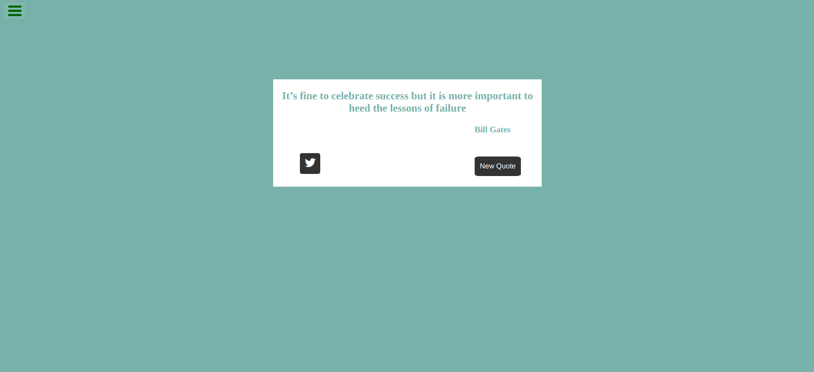
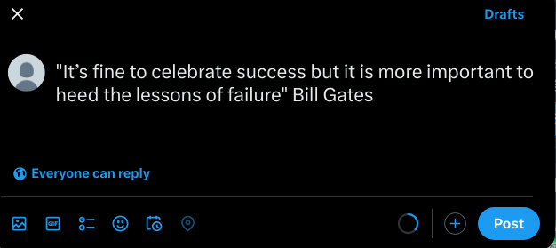

# Random Quote Machine

This project is a simple web application that displays random inspirational quotes to the user. Each time the "New Quote" button is clicked, a new quote and its author are displayed, and the UI's color scheme changes to one of the predefined colors. Users can also share the quote on Twitter by clicking the Twitter icon.

## Features

- Display a random quote and author upon initialization and on clicking the "New Quote" button.
- Change the UI's color scheme each time a new quote is displayed.
- Share the quote on Twitter via the Twitter share button.

## Technologies

- HTML
- CSS
- JavaScript
- jQuery

## Setup

To run this project, simply clone the repository and open `index.html` in your browser.
git clone https://github.com/nimeshthakur0/Random-Quotes-Generator.git open index.html

## Screenshots

*Caption 1: Main interface of the Random Quote Machine*

*Caption 2: Example of a quote that is tweeted*

## License

This project is licensed under the MIT License - see the LICENSE.md file
